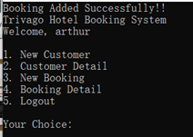

# C# Hotel Management System

**Hotel Management System** is a console-based application built with C# in Visual Studio 2019.
It provides staff authentication, customer management, and booking management through a simple text-based interface.

## Features

- **Staff Authentications**: Simple staff login and register system

### Customer Management

- **Add new customer**: Register new customer detail into the system
- **View all customer**: Display all customer
- **Search Customer**: Find customer information by name
- **Search in list**: Display all customer in list and choose to display information
- **Remove Customer**: Delete Customer from system

### Booking Management

- **Add new booking**: Add new booking on registered customer
- **View all booking**: Display all booking
- **Search booking by customer name**: Find booking information by customer name
- **Cancel booking**: Remove a booking record

## Tech Stack

- **Language**: C#
- **Framework**: .Net Console Applications
- **IDE**: Visual Studio 2019
- **Database**: MYSQL, LocalDB

## Screenshots

- **Login Process**

  
  
  

- **Register Process**

  
  
  

- **Add Customer**

  
  
  

- **Search Customer by Name**

  
  
  
  

- **Search in List**

  
  
  

- **Print All Customer**

  
  
  

- **Remove Customer**

  
  
  
  

- **Add Booking**

  
  
  

- **Search Booking by Customer Name**

  
  
  

- **Print All Booking**

  
  
  

- **Cancel Booking**

  
  
  
  

- **Logout**

  
  
